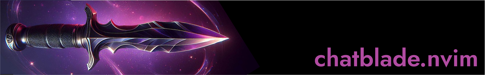

<div align="center">
    
    <br>
    <p>
        <i>Leverage <a href="https://github.com/npiv/chatblade">Chatblade</a>, the Swiss Army Knife for ChatGPT, from your Neovim editor.</i>
    </p>
</div>

## Setup

### Prerequisites

1. Install the [Chatblade](https://github.com/npiv/chatblade) CLI
2. Set the `OPENAI_API_KEY` environment variable

### Installation & Configuration

```lua
-- lazy.nvim
{
  "cmpadden/chatblade.nvim",
  keys = {
    { "<leader>x", ":Chatblade<cr>", mode = "v" },
  },
  cmd = {
    "Chatblade",
    "ChatbladeSessionStart",
    "ChatbladeSessionStop",
    "ChatbladeSessionDelete",
  },
  opts = {
    prompt  = "programmer", -- file stored at `~/.config/chatblade/programmer`
    raw     = true,         -- print session as pure text
    extract = true,         -- extract content from response if possible (either json or code)
    only    = true,         -- only display the response, not the query
  }
}
```

## Usage

### Bindings

Select text, and send it to Chatblade with your key binding of choice. For the example
of `<leader>x`, you can visually select a line or paragraph, send it to Chatblade, and
the response will be inserted below your cursor.

```
vip<leader>x
```

### Commands

The following user commands have been made available. This allows you to handle sessions
so that you can send snippets to Chatblade, and ask follow-up questions with persisted
context.

| Command                | Parameters | Description                                 |
| ---------------------- | --------- | ------------------------------------------- |
| Chatblade              | `nil`     | Send visual selection to Chatblade          |
| ChatbladeSessionStart  | `string`  | Start a session to persist context          |
| ChatbladeSessionStop   | `nil`     | Stop the currently active Chatblade session |
| ChatbladeSessionDelete | `string`  | Delete the specified Chatblade session      |

### Options

| Property           | Type       | Description                                                                                                |
| ------------------ | ---------- | ---------------------------------------------------------------------------------------------------------- |
| **prompt**         | `string?`  | Prompt to use found in the `~/.config/chatblade` directory (Default `nil`)                                 |
| **raw**            | `boolean?` | Whether to return results in pure text (Default `true`)                                                    |
| **extract**        | `boolean?` | Whether to extract code from response (Default `true`)                                                     |
| **only**           | `boolean?` | Only display the response, not the original query (Default `true`)                                         |
| **temperature**    | `float?`   | Lower values for result in more consistent outputs, whereas higher is more creative (Default 0.0; Max 2.0) |

## Motivation

If all you seek is to pass text to `chatblade` from your Neovim session, then there is no need to introduce yet another plugin. Simply add a binding like so:

```lua
vim.keymap.set("v", "<leader>x", ':!chatblade -e -r<CR>')
```

However, _chatblade.nvim_ offers some quality of life improvements over such a bindings.

- Editor based sessions
- Flexible configuration and prompt management
- **[todo]** Pass metadata and file information in prompt
